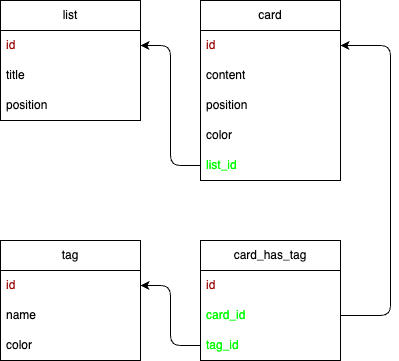

# Modèle Logique de Données (MLD)

Etape de traduction d'un MCD dans une représentation plus proche d'une implémentation dans un système de gestion de bases de données.

C'est un exercice moins académique et formalisé, plusieurs formes de représentation sont acceptées.

## Etapes de réalisation

- Traduire les noms d'entité en nom de tables
- Traduire les attributs en nom de champs/colonnes.
- Traduire les associations sous forme :
  - de clés primaires / étrangères
  - tables de liaison le cas échéant

## Version textuelle

```
list (
  id                       -- identifiant entier généré automatiquement
  title                    -- chaine de caractère
  position                 -- entier positif
)

card (
  id                       -- identifiant entier généré automatiquement
  content                  -- chaine de caractère
  position                 -- entier positif
  color                    -- chaine de caractère au format hexadecimal (#000000)
  list_id  #FK->list.id    -- entier position, clé étrangère pointant vers la table
)

tag (
  id                       -- identifiant entier généré automatiquement
  name                     -- chaine de caractère
  color                    -- chaine de caractère au format hexadecimal (#000000)
)

card_has_tag (
  id                       -- identifiant entier généré automatiquement
  tag_id   #FK->tag.id     -- entier clé etrangère
  card_id  #FK-> card.id   -- entier clé etrangère
)
```

## Version schematisée


