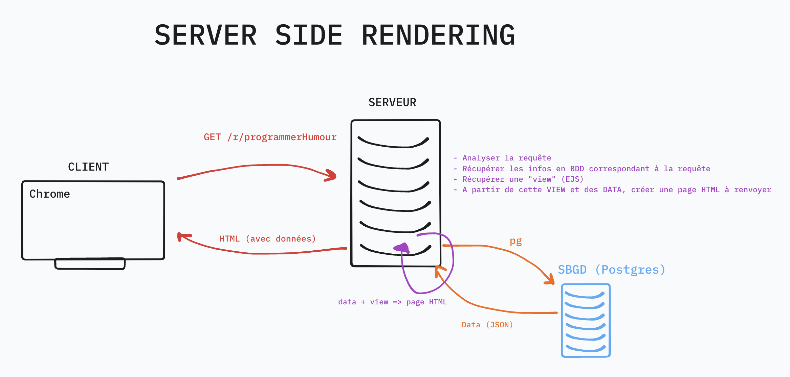
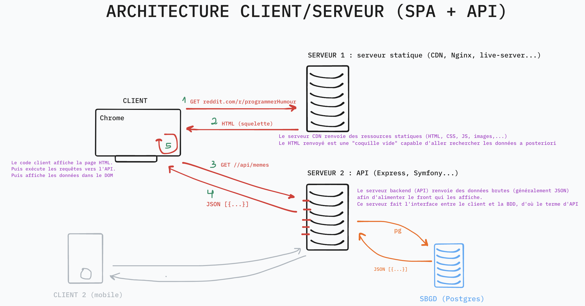

# JOUR 1 - API - Architecture client-serveur & Conception

## Menu du jour

```text
=== Matin COURS ===

- Architecture client-serveur (API & SPA)
- Découverte des API & Client HTTP
- Découverte AJAX (`fetch`)


=== Aprem ATELIER ===

- Gestion de projet
  - User stories
  - Wireframes

- Modélisation
  - MCD
  - MLD

- (Bonus) Base de données
  - Création de la base
  - Création des tables
  - Echantillonnage
```

### Retrospective architecture des saisons précédentes



Avantages :

- Simplicité
- SEO facile
- Chargement des pages

Inconvénients :

- Peu de dynamisme côté client
- Performance : le back s'occupe de calculer le rendu

### Explication architecture des saisons à venir



Avantages :

- Dynamisme : AJAX, pas besoin de recharger la page
- Separation of concerns (séparation des responsabilités)
- Facilite l'ajout de nouveaux clients (iOs, Android...)

Inconvénients :

- SEO compliqué
- Complexité

### Découverte des API

- Notion d'API au sens large
  - Slides disponibles dans le dépôt de Slides

- Comprendre que dans notre cas, l'**API est une interface entre notre frontend ET la BDD** qui se chargera de gérer les accès aux données ainsi que leur évolutions.

### Découverte des API HTTP REST

API via HTTP via différentes routes (endpoints) et qui renvoient généralement du JSON.

Exemples d'API publique :

- Pokeapi (Pokemons)
  - [https://pokeapi.co/](https://pokeapi.co/)
- Swapi (Starwars)
  - [https://swapi.dev/](https://swapi.dev/)
- OMDB (Films)
  - [https://www.omdbapi.com/](https://www.omdbapi.com/)
- OpenFoodFact (Nourriture)
  - [https://fr.openfoodfacts.org/data](https://fr.openfoodfacts.org/data)
- Open Weather (Météo)
  - [https://openweathermap.org/api](https://openweathermap.org/api)
- Unsplash (Photos)
  - [https://unsplash.com/fr](https://unsplash.com/fr)

Besoin d'une autre API ?

- [https://github.com/public-api-lists/public-api-lists](https://github.com/public-api-lists/public-api-lists)
- [https://github.com/public-apis/public-apis](https://github.com/public-apis/public-apis)

Besoin d'une API qui supporte le POST ?

- [https://jsonplaceholder.typicode.com/](https://jsonplaceholder.typicode.com/)

Besoin d'une API avec une documentation CRUD complète ?

- Spotify : [https://developer.spotify.com/documentation/web-api](https://developer.spotify.com/documentation/web-api)

### Requêter une API

- Chrome (GET)
  - Extension VSCode utile : [JSON Formatter](https://chrome.google.com/webstore/search/JSON)
- Insomnia (POST)
- [Extension REST CLient](https://marketplace.visualstudio.com/items?itemName=humao.rest-client)
- cURL (pourquoi pas !)
